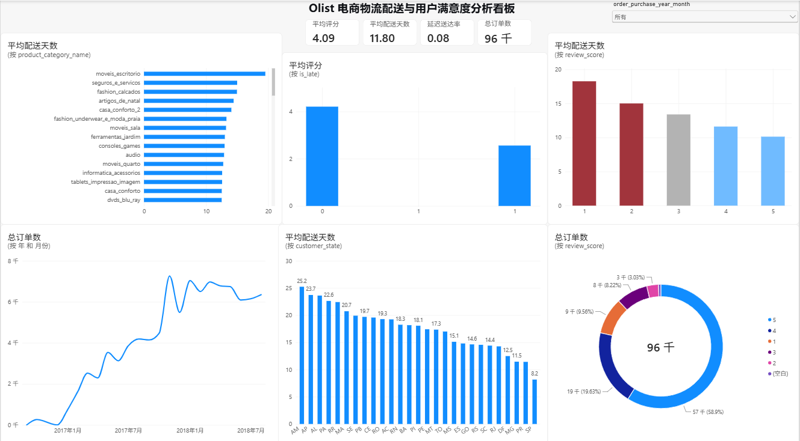

# Olist 巴西电商平台用户满意度与物流配送分析

## 📌 项目背景
Olist 是巴西最大的电商平台之一。本项目旨在通过清洗和分析 10万+ 订单数据，探索订单、物流、用户评分的关系，重点研究**物流配送时长对客户满意度的影响**。

## 📊 数据洞察与结论
*   **核心发现**：配送天数与用户评分呈显著负相关（相关系数 **-0.34**）。
*   **痛点定位**：1-2分低分订单平均配送耗时 **18.8天**，而5分好评订单仅需 **10.2天**，相差 **84%**。
*   **延迟打击**：低分订单中，高达 **32.8%** 存在延迟送达情况。
*   **品类短板**：办公家具（moveis_escritorio）、保险服务（seguros_e_servicos）、时尚鞋类（fashion_calcados）等大件或特殊品类平均配送天数最长，是物流优化的重点方向。

## 🛠️ 技术栈
*   **数据清洗与特征工程**：Python (Pandas, Numpy)
*   **探索性数据分析 (EDA)**：Matplotlib, Seaborn
*   **可视化看板**：Power BI (DAX 度量值, 交互式切片器)

## 🖼️ 可视化看板

## 📁 仓库文件说明
*   `Olist_Analysis.ipynb`：Python 数据清洗与 EDA 分析代码。
*   `clean_data.xlsx`：清洗合并后的最终数据集。
*   `Olist_Dashboard.pbix`：Power BI 交互式仪表板源文件。
*   注：Power BI 源文件由于体积较大未上传，具体分析结论请参见上方看板截图。
